# Model comparison graphs

- Inference source: Evaluation 2026-10-09T04:16:51+00:00
- Training source: Benchmark 2026-10-09T02:39:01+00:00
- Throughput source: Prediction throughput benchmark 2026-10-09T03:21:10+00:00
- Charts use a zero baseline and consistent model colors.

## Pointwise warm-rating quality

### MAE

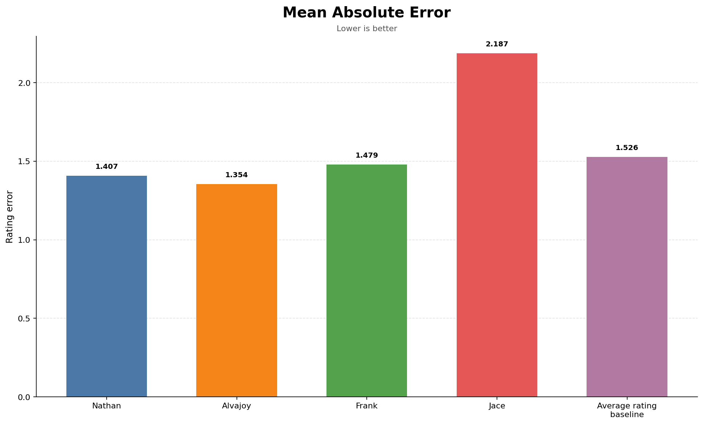

### RMSE

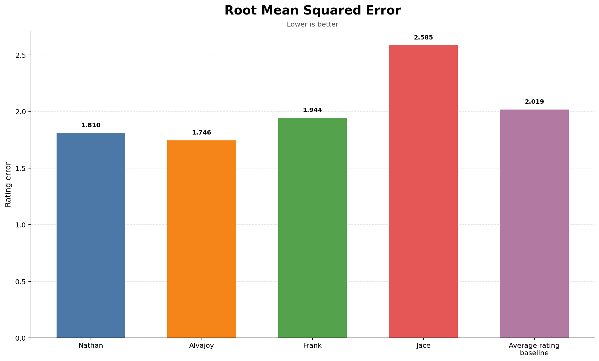

### Precision

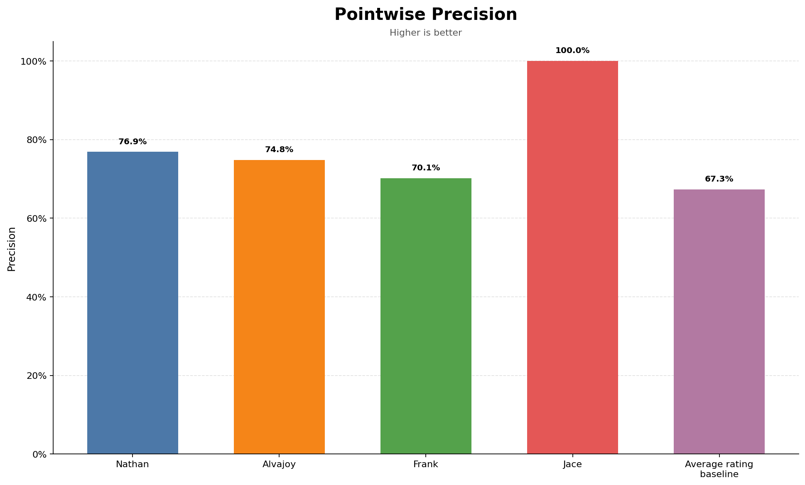

### Recall

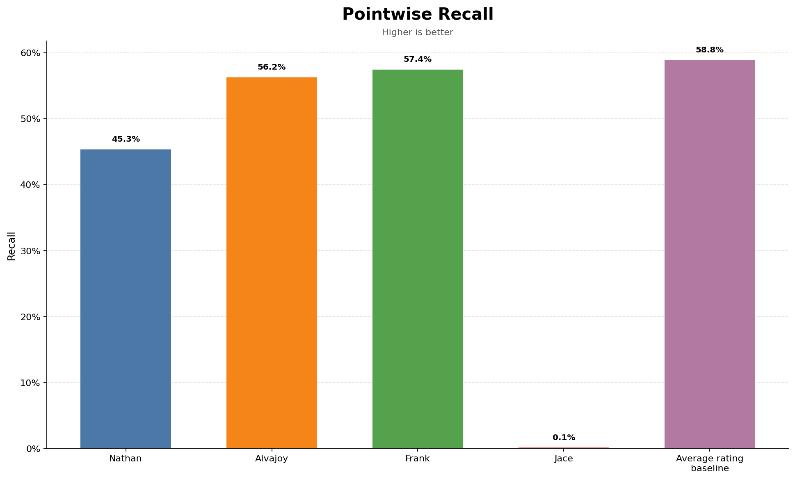

### False-positive rate

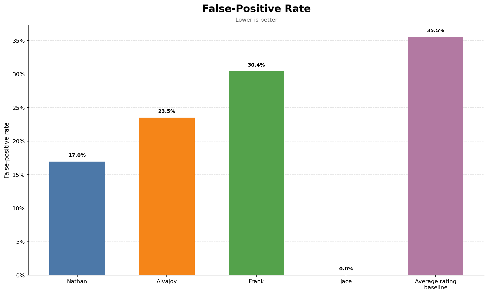

### False-negative rate

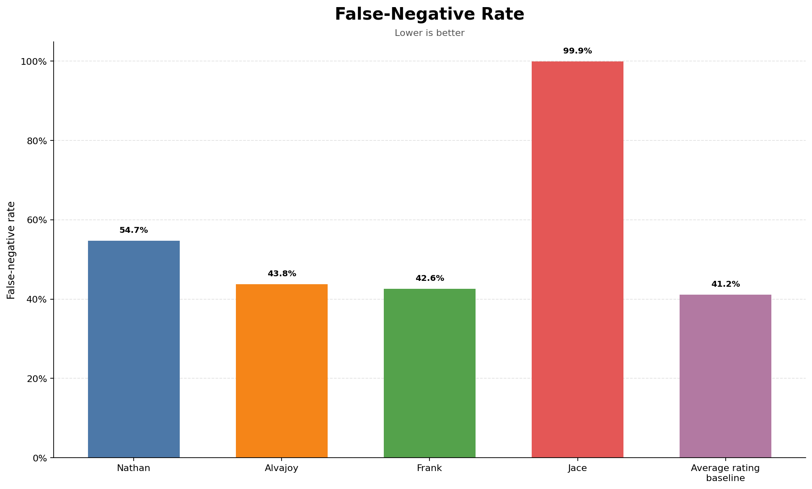

### Confusion counts

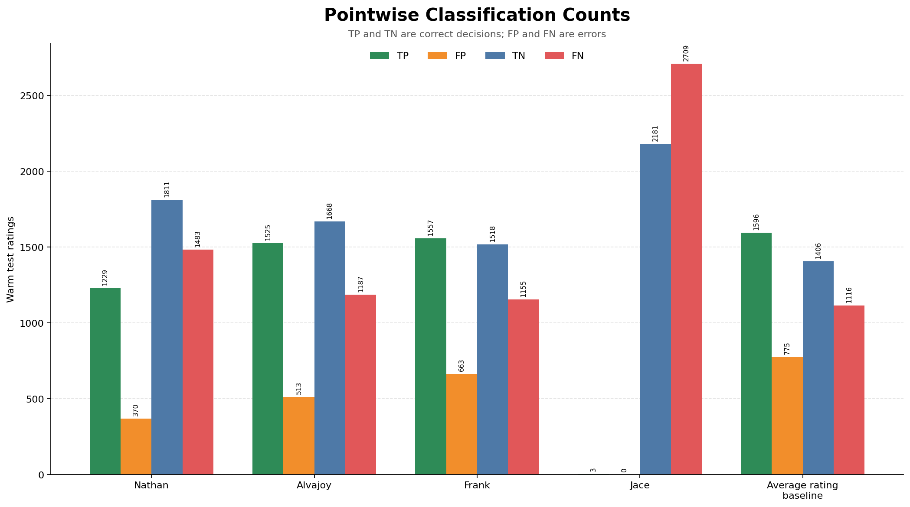

## Native top-20 recommendation quality

### Precision@20

### Recall@20

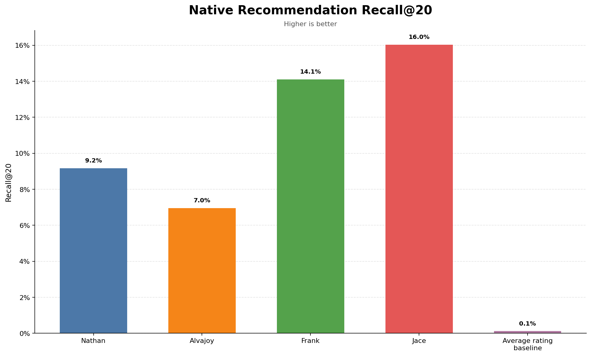

### Hit Rate@20

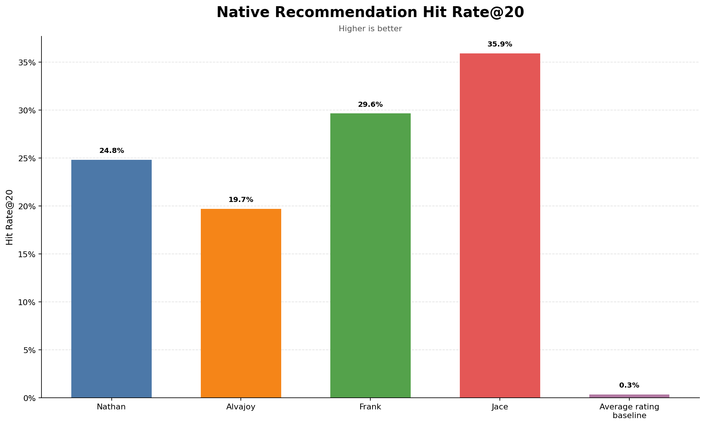

### NDCG@20

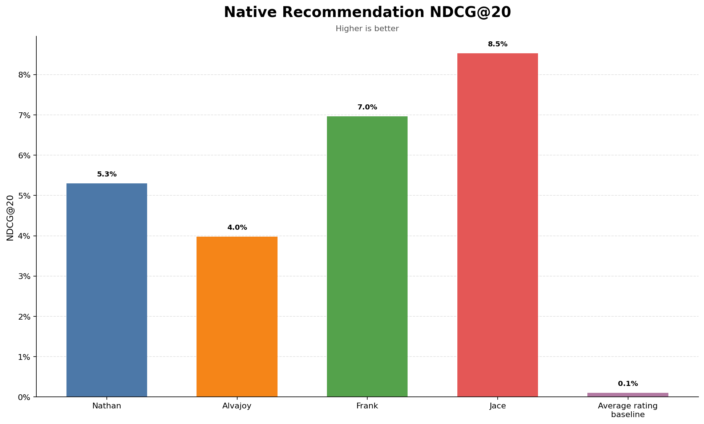

## Operational characteristics

### Average training time

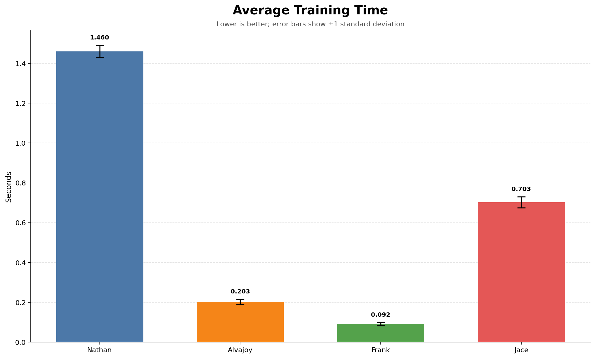

### Average top-20 request time

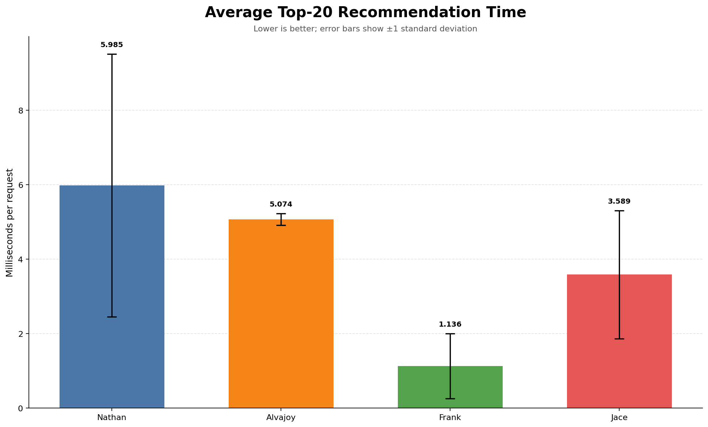

### Model artifact size

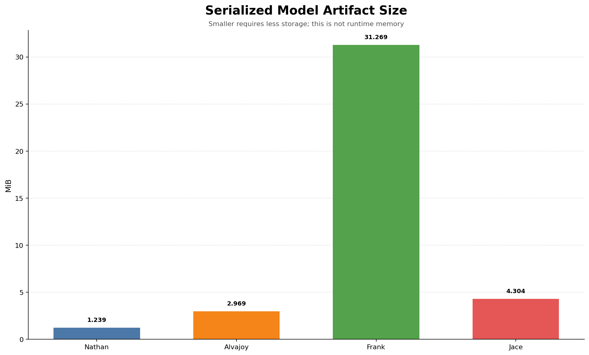

The average-rating baseline is omitted from operational and size charts because it is computed in memory and has no persisted model artifact.

Artifact size measures serialized files on disk, not peak runtime memory.
