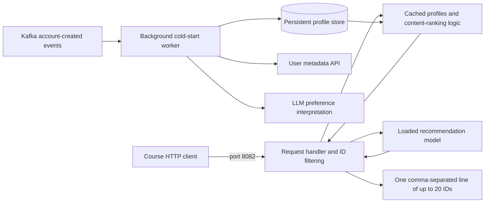

# Milestone 1 report outline — not a completed submission

Place the completed version at the **team repository root** as `m1_report.md`.
Replace every placeholder with observed facts, actual names, results and links.

## Model comparison (<=1 page text; table excluded)

For each quality, explicitly give **(1) metric, (2) data, (3) operationalization**.
Use the agreed shared protocol, not different splits for each model. Link the
measurement implementation and each M0 repository/commit. Explain why the chosen
model offers the best acceptable trade-off among the four measured qualities.

| Measure and unit | jwatson8 model | Nathan model | Frank model | Alvajoy model |
|---|---|---|---|---|
| Prediction quality: agreed metric | Rerun common protocol | Pending | Pending | Pending |
| Training cost: seconds, same boundary | Rerun common protocol | Pending | Pending | Pending |
| Inference cost: p95 ms, same workload | Rerun common protocol | Pending | Pending | Pending |
| Model size: bytes, same artifact scope | Rerun common protocol | Pending | Pending | Pending |

Do not use the current individual measurements as a completed four-model comparison.
Selected model ___; trade-off and alternatives ___; modifications ___; links ___.

## Prediction service (<=1 page)

Explain the model's ranking calculation, request handler, ID filtering and response
format. Explain automatic onboarding and LLM use for new users, when cached profiles
are used, and what happens while a profile is pending. Link training, serving and
cold-start implementations. Identify any adaptations from the selected M0 model.

## Containerization and deployment (<=0.5 page)

State containers, Compose startup, model loading/persistence, SSH deployment and
repository-owned configuration. Link Dockerfile(s), Compose and runbook. Include
an architecture view with a named question. The following is a **proposal**, not
a claim of implemented components:

**Question:** How does the VM return fast recommendations while automatically
personalizing newly created users?

Proposed trade-off: asynchronous LLM generation keeps slow language processing out
of the 600 ms request path and allows caching, but new users initially receive a
fallback and the worker/store add operational complexity. Revise to match the
actual chosen implementation and show container/VM boundaries in the final view.

## Team contract and meeting notes (<=1 page text)

Answer all five contract questions: Slack response/urgent contact, named management
responsibilities, division of work, handling delays/nonresponse, other agreements.
Link the adopted contract, actual meeting notes with who/what/when, GitHub Project,
and milestone issues. A prepared template is not evidence that a meeting happened.

Final checks: staff can access links; actual running deployment matches report;
traffic evidence collected; mentor debrief scheduled within one week; each person
completes the individual survey. Submit the latest commit URL by Sunday 23:59 ET.
