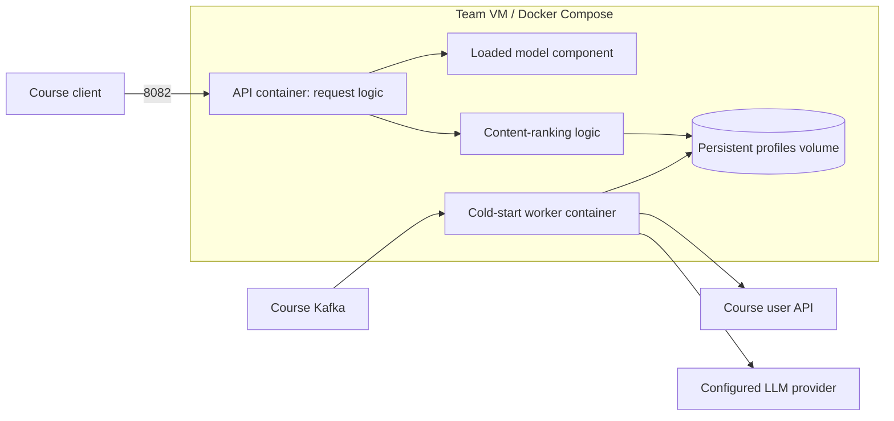

# VM deployment runbook for Milestone 1

**Status: implementation plan and configuration templates, not a deployed service.**
The existing M0 model is a command-line program. The team still needs to implement
the HTTP adapter and live cold-start worker described below. Do not treat the
Compose template as runnable until those modules and the model artifact exist.
No VM commands have been executed or containers tested as part of this runbook.
This plan does not choose the team's production model in advance of comparison.

The course requires `http://VM_ADDRESS:8082/recommend/USER_ID` to return one ordered
comma-separated line of up to 20 movie IDs within 600 ms. A working container alone
does not demonstrate successful course traffic or personalized new-user behavior.

## 1. First login: identify the machine and its state

From your own computer, use the course-provided SSH username and address:

```sh
ssh YOUR_SSH_USER@YOUR_VM_ADDRESS
```

On the VM:

```sh
cat /etc/os-release
uname -m
free -h
df -h
sudo ss -ltnp | grep ':8082' || true
sudo docker version
sudo docker compose version
```

If logged in as root, omit `sudo` if it is unavailable. A missing Docker command
means installation is needed; a daemon connection failure is a different problem.
If something already occupies port 8082, identify it with the team before replacing
it. Keep working SSH access and record any VM setup in the repository runbook.

## 2. Install Docker only if needed

For a fresh supported **Ubuntu** VM, use Docker's official apt repository:

```sh
sudo apt-get update
sudo apt-get install -y ca-certificates curl git
sudo install -m 0755 -d /etc/apt/keyrings
sudo curl -fsSL https://download.docker.com/linux/ubuntu/gpg -o /etc/apt/keyrings/docker.asc
sudo chmod a+r /etc/apt/keyrings/docker.asc
```

Create the repository definition, then install Engine and the Compose plugin:

```sh
sudo tee /etc/apt/sources.list.d/docker.sources >/dev/null <<EOF
Types: deb
URIs: https://download.docker.com/linux/ubuntu
Suites: $(. /etc/os-release && echo "${UBUNTU_CODENAME:-$VERSION_CODENAME}")
Components: stable
Architectures: $(dpkg --print-architecture)
Signed-By: /etc/apt/keyrings/docker.asc
EOF
sudo apt-get update
sudo apt-get install -y docker-ce docker-ce-cli containerd.io docker-buildx-plugin docker-compose-plugin
sudo systemctl enable --now docker
sudo docker run --rm hello-world
sudo docker compose version
```

If Docker already runs, reuse it rather than reinstalling. If packages conflict,
review the machine with the team before uninstalling anything. For Debian or
another distribution, use that distribution's instructions instead of the Ubuntu
repository. Source: [Docker's Ubuntu installation guide](https://docs.docker.com/engine/install/ubuntu/).
Docker-published ports can bypass ufw rules; verify campus/VM network access rather
than assuming a host firewall rule alone controls exposure. Do not expose the
profile database, LLM service or Docker daemon to the public network.

## 3. Check out the agreed team commit

Run as the account that will maintain the checkout:

```sh
mkdir -p ~/apps
cd ~/apps
git clone https://github.com/jwatson8/The-Neural-Network.git
cd The-Neural-Network
git fetch origin
git checkout --detach YOUR_APPROVED_COMMIT_SHA
git rev-parse HEAD
```

Replace the placeholder with the commit the team agreed to deploy. If already
cloned, reuse the directory and inspect `git status --short` before switching
versions. Keep implementation edits in a development checkout and commit/push them;
the VM should deploy those commits, not become the only copy of important changes.

## 4. Implement these repository files before deployment

Suggested file contract (paths below are a proposal, not existing modules):

```text
Dockerfile
compose.yaml
.dockerignore
.env.example
requirements.txt
requirements-service.txt
service/__init__.py
service/api.py              # exports a Flask app named app
service/profile_worker.py   # runnable with python -m service.profile_worker
service/model_adapter.py    # interfaces to whichever model wins comparison
artifacts/model.joblib      # generated/downloaded trusted model, ignored by Git
```

**Frank's API implementation:** load the selected model once at startup, then
handle `/recommend/<userid>`, rank/filter real catalog IDs, and return
`Response(','.join(movie_ids[:20]), mimetype='text/plain')`. The course response
must not contain JSON, titles or scores. Add `/health` returning 200 only after
the model is loaded and profile-store reads are available. Keep training, LLM
generation and slow metadata requests outside the recommendation request path.
Log user ID, route (collaborative/content/fallback), model version, duration and
status so the team can inspect performance and personalization.

**Cold-start implementation:** consume account-created events, retrieve the new
user's descriptions from the course API, call the selected LLM, validate its
output, and save the profile in a persistent store. Also queue an unknown ID
encountered by the API to cover delayed/missed account events. Deduplicate jobs,
retry failures with backoff and commit Kafka progress only after durable handling.
The request handler returns a fast fallback while work is pending, then uses the
new profile without retraining or restarting the service. Never count pending
fallback responses as personalized.

For a small single-VM design, SQLite with WAL, short transactions and a busy timeout
can store profiles and pending jobs in a shared Docker volume. All instances must
use the same schema and atomic updates. The API initializes the schema before
health succeeds; the worker then starts. A different shared store is acceptable
if the team documents it. Saved M0 `llm_profiles.json` entries can seed the store,
but they do not replace live profile generation.

The current `recommender.py` needs an adapter change: it rejects profiles whose
user ID is absent from the original fitted user list. The live content route must
accept a freshly retrieved user description/profile independently of that list.
The existing `cold_start.py` is an offline batch command, not a Kafka consumer.

## 5. Containerize the implementation

Use Python 3.12 to match the measured model environment. Put runtime server and
worker dependencies in `requirements-service.txt`: Flask, Gunicorn, the chosen
Kafka client, and any LLM client needed. Pin tested versions, include transitive
dependencies in your agreed lock process, and retain the selected model's numeric
library versions to avoid artifact incompatibilities.

Example **Dockerfile**, once the Step 4 files exist:

```dockerfile
FROM python:3.12-slim-bookworm
ENV PYTHONDONTWRITEBYTECODE=1 PYTHONUNBUFFERED=1
WORKDIR /app
COPY requirements.txt requirements-service.txt ./
RUN pip install --no-cache-dir -r requirements.txt -r requirements-service.txt
COPY . .
RUN useradd --uid 10001 --create-home appuser \
    && mkdir -p /state /models \
    && chown appuser:appuser /state /models
USER appuser
EXPOSE 8082
CMD ["gunicorn", "--bind", "0.0.0.0:8082", "--workers", "1", "--threads", "4", "--access-logfile", "-", "--error-logfile", "-", "service.api:app"]
```

This starts one model-holding process with four request threads. Test model/thread
safety, contention and latency on the VM before increasing concurrency. Pin the
tested base image by digest when finalizing a reproducible release. Gunicorn's
worker timeout is not the course's 600 ms response budget; measure actual HTTP
latency separately and enforce bounded work in the handler.

Example **.dockerignore**:

```text
.git
.venv
__pycache__
*.pyc
.env
.env.*
!.env.example
data
artifacts
*.zip
```

Exclude raw data and model artifacts because this design mounts a prebuilt model.
Add `.env`, `data/` and `artifacts/` to `.gitignore` as well. Never bake credentials
into an image or print the full environment/expanded Compose configuration into
shared logs.

## 6. Add compose.yaml

This is the **two-process deployment template**. The Step 4 API and worker must
honor the environment variables and shared-store contract; Docker does not
implement these application behaviors for you.

```yaml
name: neural-network

x-runtime: &runtime
  image: neural-network:${DEPLOY_TAG:-local}
  build: .
  restart: unless-stopped
  init: true
  env_file:
    - .env
  environment:
    MODEL_PATH: /models/model.joblib
    PROFILE_DB_PATH: /state/profiles.sqlite3
    OPENBLAS_NUM_THREADS: "1"
    OMP_NUM_THREADS: "1"
    MKL_NUM_THREADS: "1"
  volumes:
    - type: bind
      source: ${MODEL_FILE:?Set MODEL_FILE in .env}
      target: /models/model.joblib
      read_only: true
      bind:
        create_host_path: false
    - profiles:/state
  logging:
    driver: json-file
    options:
      max-size: "10m"
      max-file: "3"

services:
  api:
    <<: *runtime
    ports:
      - "8082:8082"
    command: ["gunicorn", "--bind", "0.0.0.0:8082", "--workers", "1", "--threads", "4", "--access-logfile", "-", "--error-logfile", "-", "service.api:app"]
    healthcheck:
      test: ["CMD", "python", "-c", "import urllib.request; urllib.request.urlopen('http://127.0.0.1:8082/health', timeout=2)"]
      interval: 15s
      timeout: 3s
      retries: 3
      start_period: 30s

  cold-start-worker:
    <<: *runtime
    command: ["python", "-m", "service.profile_worker"]
    depends_on:
      api:
        condition: service_healthy

volumes:
  profiles:
```

The same image serves HTTP and runs the background worker, so dependencies stay
consistent. The named volume survives ordinary container recreation. Keep database
schema changes backward compatible during this milestone. The `service_healthy`
condition gates initial worker startup; it does not supervise the application
forever. A healthcheck reports health; it does not itself restart an unhealthy but
still-running process. Source: [Compose startup behavior](https://docs.docker.com/compose/how-tos/startup-order/).

The template deliberately leaves the LLM provider configurable. If using an external
API, use a key accessible to the team/staff through the agreed secure method. If
using Ollama, add a real Ollama container and a persistent model cache, pull the
selected model before enabling the worker, and budget VM RAM/disk for it. Inside
the worker container, `localhost` is the worker itself, not the VM or a separate
Ollama container. Use its Compose service name, such as `http://ollama:11434`, and
do not publish that port externally. The API profile cache is not an LLM.

## 7. Prepare a versioned model and environment

Generate or download the **selected** model using the agreed training pipeline and
library versions. For the current M0 SVD candidate, its command is:

```sh
python recommender.py train
```

That example applies only after bringing this candidate's code, environment and
data into the deployment workflow; it is not a universal command for all four
models. Save an immutable, versioned artifact rather than overwriting the currently
mounted one. For example, after training in a separate staging environment:

```sh
mkdir -p artifacts
cp /PATH/TO/TRAINED/model.joblib artifacts/model-v1.joblib
sha256sum artifacts/model-v1.joblib
cp .env.example .env
chmod 600 .env
```

Replace the path above. Do not rerun `cp .env.example .env` over a configured `.env`.
Example tracked **.env.example**; fill real settings only in the untracked `.env`:

```dotenv
DEPLOY_TAG=REPLACE_WITH_COMMIT_SHA
MODEL_FILE=./artifacts/model-v1.joblib
MODEL_VERSION=model-v1
KAFKA_BOOTSTRAP_SERVERS=REPLACE_WITH_COURSE_VALUE
KAFKA_TOPIC=movielogTEAM_NUMBER
KAFKA_GROUP_ID=team-TEAM_NUMBER-cold-start-v1
USER_API_BASE_URL=http://REPLACE_WITH_COURSE_HOST:8080
LLM_PROVIDER=REPLACE_WITH_IMPLEMENTED_PROVIDER
LLM_MODEL=REPLACE_WITH_SELECTED_MODEL
LLM_BASE_URL=REPLACE_WITH_PROVIDER_URL
LLM_API_KEY=
```

Add authentication/TLS variables to match the actual course Kafka client setup.
These names are the proposed application contract, not claims about supplied
credentials. Choose a Kafka start/reset policy intentionally: do not blindly replay
all historical accounts into paid LLM calls or skip accounts needed for coverage.
Ensure the mounted model is readable by container UID 10001 and only load trusted
joblib artifacts. Record data snapshot, source commit and artifact hash.

## 8. Validate and start

From the team repository root on the VM, once Steps 4–7 are complete:

```sh
test -s artifacts/model-v1.joblib
sudo docker compose config --quiet
sudo docker compose up -d --build --wait --wait-timeout 120
sudo docker compose ps
sudo docker compose logs --tail=100 api cold-start-worker
```

The first command checks the example artifact path; update it if using another
version. `--wait` waits for running/healthy service state, not for evidence that
Kafka consumption or LLM generation works. Source: [docker compose up](https://docs.docker.com/reference/cli/docker/compose/up/).

## 9. Test on the VM, then from your laptop

On the VM:

```sh
curl --fail --max-time 2 http://127.0.0.1:8082/health
curl --fail --max-time 0.6 -w '\nHTTP=%{http_code} total=%{time_total}s\n' \
  http://127.0.0.1:8082/recommend/1
```

From your laptop, replacing the VM address (use `curl.exe` in Windows PowerShell):

```sh
curl --fail --max-time 0.6 -w '\nHTTP=%{http_code} total=%{time_total}s\n' \
  http://YOUR_VM_ADDRESS:8082/recommend/1
```

`-w` adds diagnostic text in your terminal only; it does not change the API body.
Use a real test user ID appropriate to the chosen model. Test several known users,
an unknown ID, and a new user whose description differs from others. Confirm
valid catalog IDs, no duplicates, no more than 20 IDs, one line, and plain text.
Repeat enough calls to inspect p50/p95/p99, not just one fast request.

If local requests succeed but laptop requests fail, inspect published ports,
listening address, campus networking and access rules. Do not disable the firewall
or change SSH rules as a blanket fix. If requests time out, inspect API logs,
startup/model loading, worker saturation and resource usage.

## 10. Prove cold start and course traffic

Observe or use an authorized test account-created event. Record the user ID and
event time, API lookup, LLM completion, persisted profile version and subsequent
content-route response. Verify a container restart retains the profile. Do not
inject events into course Kafka unless course staff permits it.

In the course stream, find requests to this team's server and corresponding status
200 entries. Record the deployment commit, chosen observation window and counts.
You need >=2,000 successful course requests and personalized successful responses
for >=10% of **all requests** in the applicable 24-hour before/after-submission
window. Local smoke tests do not satisfy that evidence. Correlate your route logs
with Kafka outcomes so fallback recommendations are not mislabeled personalized.

## 11. Routine inspection, updates and rollback

```sh
sudo docker compose ps
sudo docker compose logs --tail=100 api
sudo docker compose logs --tail=100 cold-start-worker
sudo docker stats --no-stream
df -h
```

For a new release, fetch and check out the agreed commit, prepare a new immutable
artifact if needed, update `.env`'s `DEPLOY_TAG`, `MODEL_FILE` and `MODEL_VERSION`,
then run the Step 8 startup command and repeat validation. Record the old commit,
image tag and model path before updating. Keep the prior artifact/image until the
new release is verified. A restart gap is acceptable in M1.

For rollback, check out the recorded previous commit and restore its model path
and tag in `.env`, then run the startup command. This assumes compatible profile
schema and external settings; record any required migrations. Preserve the profile
volume. **Do not use `docker compose down -v`** as a restart command: it deletes
named volumes and can discard profiles. Do not run broad Docker prune commands on
a shared VM without understanding what else uses its images/volumes.

## Architecture and report trade-off

**Question answered: how are fast requests separated from slow new-user profiling?**



The model is distinct from the surrounding API/content/business logic. The worker
does slow LLM work asynchronously. This protects request latency and avoids repeating
generation on every request, but newly arrived users initially receive a fallback
and the team must operate a worker plus durable state. The exact final diagram
must match the implemented system, including any locally hosted LLM container.

Before calling deployment complete, have a second teammate reproduce startup from
the same commit and documented environment. Link the actual Dockerfile, Compose,
worker/API implementation and runbook in the final M1 report.
